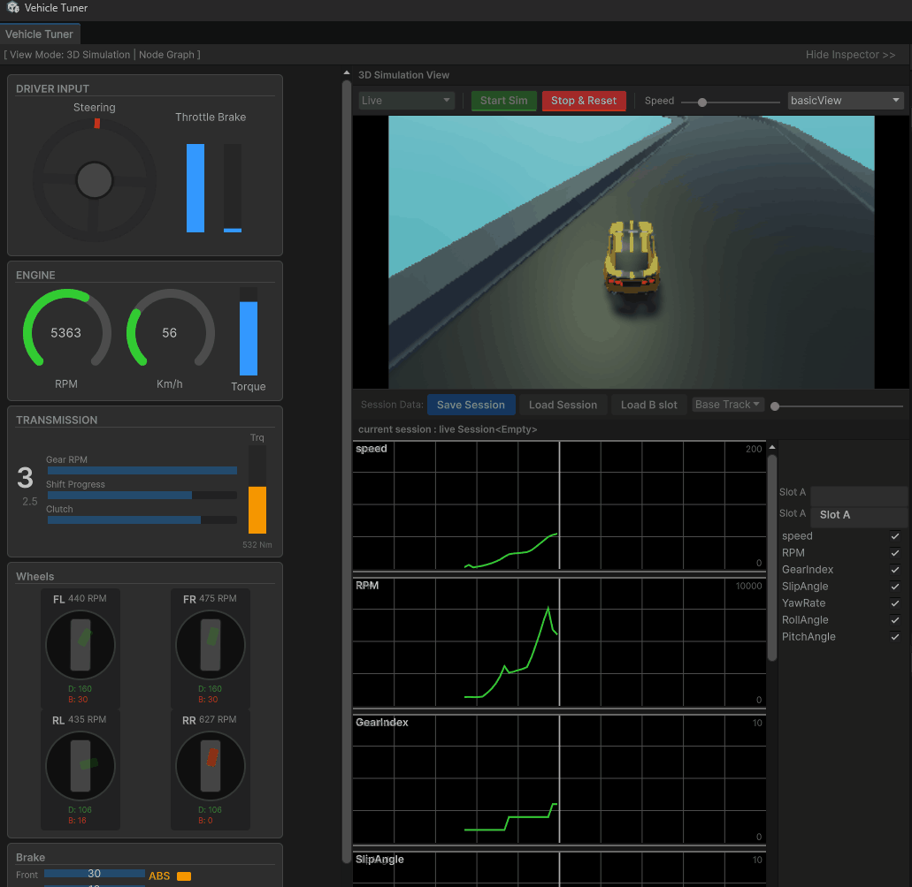
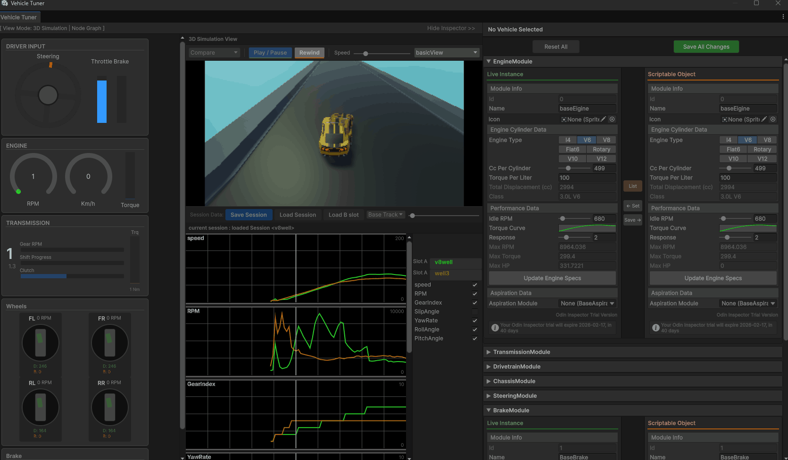

# Car Tuning Project

## 개요
- ML-Agents를 이용하여 학습시킨 차량에이전트 모델을 기반으로 Editor Window를 통하여 차량의 성능을 튜닝하고 변화에 따른 주행을 관찰하는 툴을 제작하는 프로젝트입니다.

### 사용기술 및 환경
 - Unity 6.x
 - ML-Agents release 23, 24
 - Odin Inspector

## 간략한 주요 기능

- 차량에 학습된 모델을 탑재하고, 차량의 튜닝 한 후(Engine Torque, Transmission ratio 등을 튜닝) 시뮬레이션을 통해 차량 주행을 관찰한다.

- 시뮬레이션 정보를 저장하고 서로 다른 튜닝값을 가진 차량의 주행을 비교한다.

 

